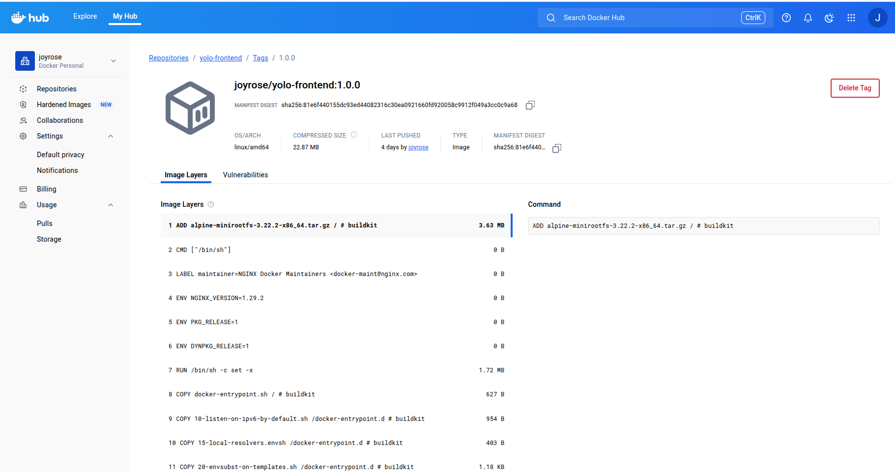

## Yolo E-Commerce App

This is a fully containerized full-stack e-commerce platform built with MongoDB, Express (Node.js), and React, orchestrated using Docker and Docker Compose.

## Local Set-up
To run this project locally on your machine follow these steps :

1. Fork this repository to your GitHub account.

2. Open your terminal.

3. Clone the repository using the SSH URL:

    git clone <your-forked-repo-ssh-url>

4. Navigate into the project directory:

    cd yolo

5. Open the project in VS Code:

    code .

6. Start writing the code as per the requirements

**Base Image Selection**

The Yolo E-Commerce App uses optimized, secure, and minimal Docker base images to ensure fast builds, small image sizes, and better security.

## 1. Backend – Node.js Server

| Stage   | Base Image      | Rationale |
|---------|-----------------|-----------|
| Build   | `node:18-alpine`  | - Lightweight and secure Node.js image<br>- Optimized for faster builds and dependency installation<br>- Includes essential build tools for compiling native modules<br>- Regularly updated with the latest security patches<br>- Ideal for CI/CD and production-ready builds |
| Runtime | `alpine:3.18`     | - Extremely small image size (~5 MB) for faster deployment<br>- Minimal packages reduce the attack surface<br>- Perfect for lightweight applications and microservices<br>- Compatible with multi-stage builds for smaller, cleaner final images<br>- Low memory footprint improves performance and scalability |

## 2. Frontend – React Application

| Stage   | Base Image      | Rationale |
|---------|-----------------|-----------|
| Build   | `node:18-alpine`  | - Efficiently compiles and bundles the React application<br>- Lightweight image that minimizes build container size<br>- Includes necessary tools for dependency installation and optimization |
| Runtime | `nginx:alpine`    | - Serves static React files quickly and reliably<br>- Minimal image size ensures faster startup and deployment<br>- Optimized for high performance and low resource consumption |

## 3. Database – MongoDB

| Container   | Base Image | Rationale |
| ----------- | ---------- | --------- |
| MongoDB | `mongo:6`  | <ul><li>Official and stable MongoDB image</li><li>Supports volume persistence</li><li>Great for local development</li></ul> |


**Dockerfile Breakdown**

The application uses multi-stage builds to separate build and runtime stages, keeping the final image small, fast, and secure.

## Backend – Node.js API (./backend/Dockerfile)

`FROM` node:18-alpine AS build

`WORKDIR` /usr/src/app

`COPY` package*.json ./
`RUN` npm install

`COPY` . .

`FROM` alpine:3.18

`WORKDIR` /app

`RUN` apk add --no-cache nodejs

`COPY`--from=build /usr/src/app /app

`ENV` NODE_ENV=production
`ENV` PORT=5000

`EXPOSE` 5000

`CMD` ["node", "server.js"]


**Explanation**
| Directive                       | Description                                           |
| ------------------------------- | ----------------------------------------------------- |
| `FROM node:18-alpine AS build`  | Uses a lightweight Node.js image for the build stage. |
| `WORKDIR /usr/src/app`          | Defines the working directory for the build process.  |
| `COPY package*.json ./`         | Copies dependency files for caching.                  |
| `RUN npm install`               | Installs backend dependencies.                        |
| `COPY . .`                      | Copies all source files.                              |
| `FROM alpine:3.18`              | Starts a new lightweight runtime stage.               |
| `RUN apk add --no-cache nodejs` | Installs Node.js in the final image.                  |
| `COPY --from=build`             | Copies compiled files from the build stage.           |
| `EXPOSE 5000`                   | Opens port 5000 for API access.                       |
| `CMD ["node", "server.js"]`     | Starts the backend server.                            |


## Frontend – React App (./client/Dockerfile)

`FROM` node:18-alpine AS build

`WORKDIR` /app

`ENV` NODE_OPTIONS=--openssl-legacy-provider

`COPY` package*.json ./
`RUN` npm install

`COPY` . .
`RUN` npm run build

`FROM` nginx:alpine
`COPY` --from=build /app/build /usr/share/nginx/html
`EXPOSE` 80
`CMD` ["nginx", "-g", "daemon off;"]

**Explanation**

| Directive                                    | Description                                     |
| -------------------------------------------- | ----------------------------------------------- |
| `FROM node:18-alpine AS build`               | Uses Node.js to build the React app.            |
| `WORKDIR /app`                               | Sets the working directory.                     |
| `ENV NODE_OPTIONS=--openssl-legacy-provider` | Fixes OpenSSL compatibility issue with Webpack. |
| `RUN npm install`                            | Installs React dependencies.                    |
| `RUN npm run build`                          | Builds the production-ready app.                |
| `FROM nginx:alpine`                          | Uses NGINX to serve the static files.           |
| `COPY --from=build`                          | Copies built React files to NGINX.              |
| `EXPOSE 80`                                  | Exposes NGINX’s default port.                   |
| `CMD ["nginx", "-g", "daemon off;"]`         | Runs NGINX in the foreground.                   |


The system uses a custom bridge network for internal communication between services.
This allows containers to reference each other by name while keeping them isolated from the host environment.


## Network Configuration

```yaml
networks:
  yolo-network:
    driver: bridge
```

## Explanation
| Key            | Description                                            |
| -------------- | ------------------------------------------------------ |
| `yolo-network` | User-defined bridge network connecting all services.   |
| `bridge`       | Default Docker driver for container interconnectivity. |


## Network Usage per Service
```yaml
services:
  mongo:
    networks:
      - yolo-network

  backend:
    networks:
      - yolo-network

  frontend:
    networks:
      - yolo-network
```

| **Service**  | **Container Port** | **Host Port** | **Purpose**                     |
| -------- | -------------- | --------- | ----------------------------- |
| MongoDB  | `27017`          | `27017`     | Database access             |
| Backend  | `5000`           | `5000`      | API server                  |
| Frontend | `80`             | `3000`      | NGINX serving the React app |


## Volume Setup
**mongo-data:/data/db** stores MongoDB data persistently, ensuring that data remains even after container restarts.

```yaml
volumes:
  mongo-data:
```

## Git Workflow Summary
The following outlines the step-by-step Git workflow adopted throughout the project:

1. Removed the initial Dockerfiles and docker-compose setup to start afresh.

2. Created a new Dockerfile for the backend service based on the `node:18-alpine image`.

3. Added a multi-stage Dockerfile for the frontend service to optimize build efficiency and image size.

4. Developed a docker-compose.yaml file defining services for MongoDB, backend, and frontend.

5. Built and pushed both backend and frontend images to DockerHub, tagging them with version numbers.

6. Updated the README.md file to reflect current configurations and deployment details.

7. Provided explanations and justifications for the selected base images used in each service.

8. Documented key Dockerfile directives for better maintainability and understanding.

9. Explained the networking configuration implemented in Docker Compose.

10. Described the Docker volumes setup and how data persistence was achieved.

11. Initialized a new Vagrantfile for environment provisioning.

12. Created a basic Ansible inventory and playbook.yml to automate setup tasks.

13. Added a variables file to define container parameters and network configurations.

14. Implemented a common role in Ansible to install Docker and configure network settings.

15. Created a MongoDB role to deploy the database container with a persistent volume.

16. Added a backend role for deploying the Node.js API container.

17. Included a frontend role to launch the React application container.

18. Updated the Vagrantfile with improved configurations and error corrections.

19. Established a manifest directory and added the yolo-frontend deployment file.

20. Defined a frontend service to enable browser-based access.

21. Added a backend deployment manifest for internal API operations.

22. Configured a backend service for inter-container communication.

23. Developed a MongoDB StatefulSet manifest for database management.

24. Configured a MongoDB service to facilitate connectivity between components.

25. Fixed all the errors and updated the README.md with final instructions and deployment details.


## Deployment Overview
I ensured that: 

**Fully containerized stack using Docker & Compose**

**Deployed and tested in Vagrant with Ansible automation**

**Verified backend and frontend images available on DockerHub**

## Backend Docker Image

`joyrose/yolo-backend:1.0.0`


## Frontend Docker Image

`joyrose/yolo-frontend:1.0.0`

Docker Best Practices I Implemented include:

1. Utilized multi-stage builds to optimize and significantly reduce final image size.

2. Applied version tagging to maintain clear version control and traceability of builds.

3. Selected lightweight base images to enhance performance, security, and deployment speed.

4. Published production-ready images to DockerHub for streamlined distribution and reusability.


## joyrose/yolo-backend:1.0.0

## joyrose/yolo-frontend:1.0.0

## DockerHub Screenshots

### Backend Image


### Frontend Image



## UTILIZATION OF ANSIBLE AUTOMATION IN THE YOLO E-COMMERCE PROJECT

## Project Overview
This project automates the deployment of a containerized YOLO E-Commerce web application using a fully scripted Infrastructure as Code (IaC) approach.

The setup combines:

**Vagrant** - to provision a virtual machine (VM) as the deployment environment.

**Ansible** - to automatically install dependencies and configure the application stack.

**Docker** - to containerize and run all the application services.

With this setup, the entire application can be deployed inside a VM using a single command:

`vagrant up`

## Deployment Workflow

The automation follows a modular structure, organized into Ansible roles, each responsible for a specific part of the setup.
The deployment process runs in four main stages:

**Common Role** – Prepares the base environment.

**MongoDB Role** – Sets up the database container.

**Backend Role** – Deploys the Node.js API service.

**Frontend Role** – Launches the React web interface.

Each role is triggered in sequence through the `playbook.yml` file, ensuring smooth dependency flow between services.

## Each Role Explaination
## 1. Common Role - Sets up the essential system tools and base configuration for Docker deployment.

**Major Tasks**

- Updates system packages.

- Installs git and `docker.io`.

- Downloads and installs the latest version of Docker Compose.

- Starts and enables the Docker service.

- Creates a Docker network (`yolo-network`) to link all containers.

- Clones the YOLO application repository from GitHub into `/home/vagrant/yolo-app`.

## 2. MongoDB Role - Deploys the MongoDB database container.

**Major Tasks**

- Pulls the official MongoDB image (`mongo:6`).

- Creates a container named `mongo-db`.

- Exposes port **27017** internally for database communication.

- Mounts a persistent volume `mongo-data` for data storage.

- Connects the MongoDB container to the shared Docker network.

## 3. Backend Role - Runs the backend Node.js API that communicates with MongoDB.

**Major Tasks**

- Pulls the backend image: `joyrose/yolo-backend:1.0.0`.

- Creates a container named `backend-container`.

- Exposes port **5000** for API access.

- Links to the MongoDB container through the `yolo-network`.

## 4. Frontend Role - Deploys the user-facing React application.

**Major Tasks**

- Pulls the frontend image: `joyrose/yolo-frontend:1.0.0`.

- Creates a container named `frontend-container`.

- Maps internal port **80** to host port **3000** (so the app is accessible via `http://localhost:3000`).

- Connects to the same `yolo-network` for backend communication.


## How Ansible Automation Works

The automation relies on a combination of:

`Vagrantfile` - Defines the base Ubuntu VM and triggers Ansible provisioning.

`playbook.yml` -  Controls the flow of execution and loads all roles.

`vars/main.yml` - Stores configurable variables like image names, ports, and directories.

`roles/` - Contains modular Ansible roles (`common, mongo, backend, frontend`), each with its own `tasks/main.yml`.

All configurations are reusable, making the setup scalable and easy to maintain.

## Part of the folder structure

```
YOLO/
├── Vagrantfile
├── ansible.cfg
├── playbook.yml
├── vars/
│   └── main.yml
├── roles/
│   ├── backend/
│   │   └── tasks/main.yml
│   ├── common/
│   │   └── tasks/main.yml
│   ├── frontend/
│   │   └── tasks/main.yml
│   └── mongo/
│       └── tasks/main.yml
└── README.md
```

## The Reasoning Behind this Design

**Modularity** - Each role focuses on a single component, improving clarity and reusability.

**Declarative Infrastructure** - Every environment can be replicated consistently with one command.

**Ease of Maintenance** - Variables (like ports, image tags, and paths) are centralized in one file.

**Automation-First Approach** - No manual installation or container management required.

## YOLO Application Kubernetes Deployment

**Overview**

This repository contains the Kubernetes manifests and deployment setup for the YOLO application. The project leverages Kubernetes orchestration to deploy a frontend, backend, and MongoDB database with proper scaling, persistent storage, and public access.

**Kubernetes Objects Used**
The deployment makes use of the following Kubernetes objects:

**1. StatefulSet (MongoDB)**:

- Ensures that MongoDB has a stable network identity and persistent storage, so data persists even if the pod is restarted.

- Provides ordered deployment and scaling, making it ideal for databases that require stable identifiers and volume attachment.

**2. Deployments (Backend & Frontend)**:

- Automatically manages pod creation, scaling, and updates.

- Supports rolling updates and self-healing to ensure high availability.

- Enables multiple replicas to run simultaneously for load balancing and fault tolerance.

**3. Services**:

**ClusterIP**: Used for internal communication between the backend and MongoDB. Pods can discover and communicate with each other reliably.

**LoadBalancer**: Exposes the frontend service to the internet, allowing users to access the application via a public IP address.

**4. PersistentVolumeClaims (PVCs)**:

- Provides persistent storage for MongoDB, ensuring that data is not lost even if pods are deleted or rescheduled.

- This aligns with best practices for stateful applications running in Kubernetes.

## Prerequisites

Before deploying this project, make sure the following requirements are met:
1. A running Kubernetes cluster, preferably on Google Kubernetes Engine (GKE), with `kubectl` configured and connected.
2. Docker images for the backend and frontend pushed to Docker Hub:

`joyrose/yolo-backend:1.0.0`

`joyrose/yolo-frontend:1.0.0`

3. Familiarity with basic Kubernetes commands such as `kubectl apply`, `kubectl get pods`, and `kubectl get svc`.
4. Ensure that sufficient cluster resources (CPU, memory, and storage) are available to deploy the StatefulSet and multiple replicas.

## Kubernetes Manifests Setup

## 1. Organize Manifest Files
- Create a manifests folder and add separate files for each component of the application. This modular approach makes it easier to maintain and update the deployment.

`mkdir -p manifests`
`cd manifests`
`touch frontend-deployment.yml backend-deployment.yml mongo-statefulset.yml`
`touch frontend-service.yml backend-service.yml mongo-service.yml`

**Manifest Responsibilities:**

| File Name               | Kubernetes Object        | Purpose                                                                                              |
|-------------------------|-------------------------|------------------------------------------------------------------------------------------------------|
| `frontend-deployment.yml`   | `Deployment`            | <ul><li>Deploys the React frontend application.</li><li>Defines replicas, rolling updates and pod spec.</li></ul> |
| `frontend-service.yml`      | `Service (LoadBalancer)`| <ul><li>Exposes the frontend publicly via an external IP / cloud load balancer.</li><li>Handles ingress traffic for user access.</li></ul> |
| `backend-deployment.yml`    | `Deployment`            | <ul><li>Deploys the Node.js backend API.</li><li>Manages scaling, liveness/readiness probes and environment variables.</li></ul> |
| `backend-service.yml`       | `Service (ClusterIP)`   | <ul><li>Internal-only service for backend communication within the cluster.</li><li>No external exposure; used by frontend and other internal components.</li></ul> |
| `mongo-statefulset.yml` | `StatefulSet`           | <ul><li>Runs MongoDB with stable network IDs and persistent storage (PVCs).</li><li>Ensures ordered startup and durable volumes per replica.</li></ul> |
| `mongo-service.yml`         | `Service (Headless)`    | <ul><li>Headless service (ClusterIP: None) to provide stable DNS names for StatefulSet pods.</li><li>Facilitates direct pod-to-pod communication and replica discovery.</li></ul> |

## 2. Apply Kubernetes Resources
Deploy the application in the following order to ensure dependencies are available before the dependent services start:

**Step 1: MongoDB**
`kubectl apply -f manifests/mongo-service.yml`
`kubectl apply -f manifests/mongo-statefulset.yml`

- This ensures that MongoDB is available before the backend connects.
- The StatefulSet provides persistent storage and stable networking.


## Author: Joyrose Kinuthia
## Tech Stack: MongoDB | Express | React | Node.js | Docker | NGINX | Ansible | Vagrant
